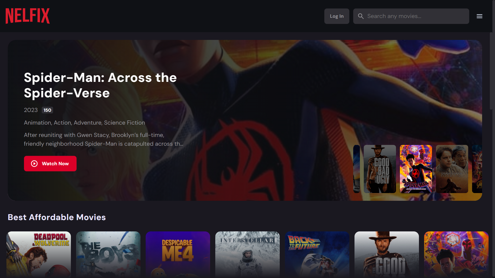
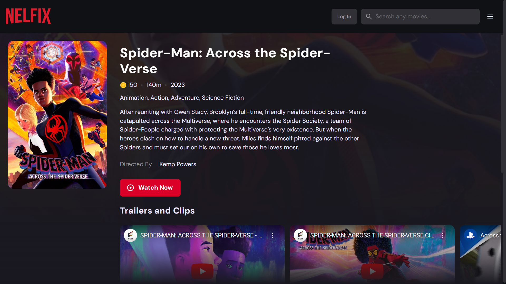
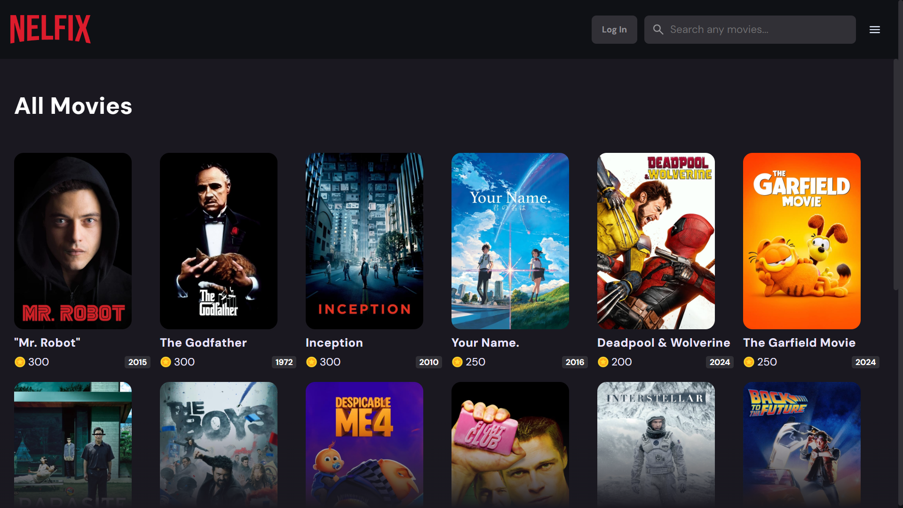
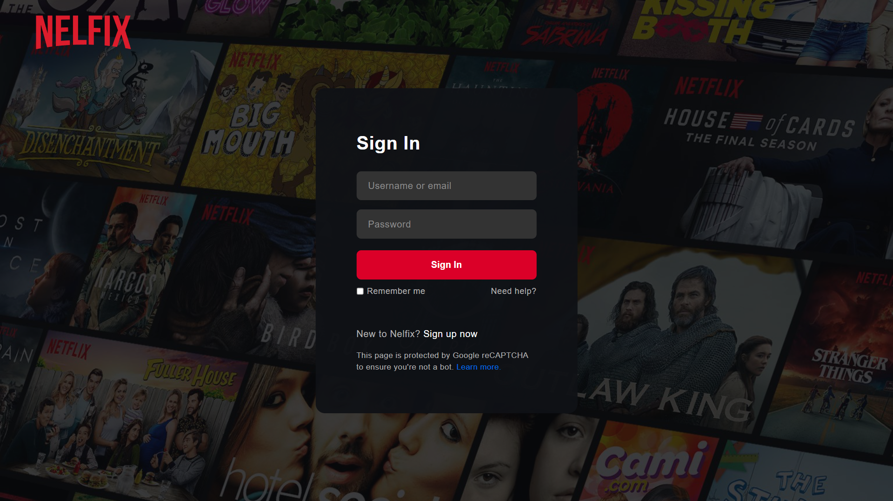

<h1 align="center">📺 Nelfix 📺</h1>

<h2 id="table-of-contents">🔍 Daftar Isi</h2>
- <a href="#table-of-contents">🔍 Daftar Isi</a> 
- <a href="#preview">👀 Preview</a> 
- <a href="#how-to-run">🚶‍♂️ Menjalankan Program</a> 
- <a href="#design-pattern">📊 Design Pattern</a> 
- <a href="#tech-stack">💻 Tech Stack</a> 
- <a href="#endpoint">📞 Endpoint</a> 
- <a href="#bonus">✨ Bonus</a> 
- <a href="#author">🙇‍♂️ Kontributor</a>

<h2 id="preview">👀 Preview</h2>

<h2 id="how-to-run">🚶 Menjalankan Program</h2>

1. Download ZIP atau clone repository
1. Buat bucket di Amazon S3, kemudian letakkan nama bucket, region bucket, serta access key di file .env
2. Jalankan program terminal (misalnya Command Prompt, Powershell, dan semacamnya).
3. Pindah current directory ke folder ini, yaitu `(folder download)\Nelfix`.
4. Install dependencies dengan mengetik `npm install`.
5. Jalankan command `npm run start:dev` untuk memulai program.
6. Di terminal lainnya, jalankan `docker-compose up`. Kemudian buka terminal lain untuk menjalankan `npx prisma migrate dev --name init`.
7. Ketik `http://localhost:3000` pada browser favorit Anda.
8. Proses seeding telah menambahkan akun admin dengan username `admin` dan password `admin123`.
9. Berhentikan docker dengan command `docker-compose down --volumes`.

<h2 id="design-pattern">📊 Design Pattern</h2>

1. Singleton
   

   Digunakan design pattern singleton untuk mengontrol akses ke database. Karena database dipakai di seluruh aspek program, dibutuhkan akses global ke instans database yang sama. Kelas-kelas yang diinisiasi dengan design pattern singleton adalah kelas yang berinteraksi dengan database, seperti UsersService, FilmService, dan HistoryService. Kelas-kelas ini menyediakan layanan database pada seluruh program tanpa membuat program berinteraksi langsung dengan database.
   

2. Command
   

   Design pattern command digunakan untuk mengeksekusi perintah seperti kueri films dan mengambil detail films. Hal ini dikarenakan route yang digunakan untuk berinteraksi dengan bagian frontend berbeda dengan REST API. Meskipun begitu, kedua endpoint ini memiliki kesamaan fungsi kueri film. Oleh karena itu, digunakan sebuah kelas command yang akan mengeksekusi operasi kueri pada database.
   

   
3. Facade
   

   Design pattern facade digunakan terutama pada operasi upload file dan video film. Design pattern ini menyembunyikan detail implementasi upload dan delete file pada bucket Amazon S3. Detail implementasi seperti ekstraksi key pada bucket, proses upload/delete file, serta proses pengembalian url disembunyikan dibalik kelas service. Dengan design pattern ini, fungsionalitas upload/delete file dapat digunakan tanpa membuat kode rumit. 
   

<h2 id="tech-stack">💻 Tech Stack</h2>

1. NestJS&nbsp;&nbsp;&nbsp;&nbsp;&nbsp;&nbsp;&nbsp;&nbsp;&nbsp;&nbsp;&nbsp;10.4.4
2. Prisma&nbsp;&nbsp;&nbsp;&nbsp;&nbsp;&nbsp;&nbsp;&nbsp;&nbsp;&nbsp;&nbsp;5.18.0
3. Docker&nbsp;&nbsp;&nbsp;&nbsp;&nbsp;&nbsp;&nbsp;&nbsp;&nbsp;&nbsp;&nbsp;25.0.3
4. NPM&nbsp;&nbsp;&nbsp;&nbsp;&nbsp;&nbsp;&nbsp;&nbsp;&nbsp;&nbsp;&nbsp;&nbsp;&nbsp;&nbsp;10.3.0
5. PostgreSQL&nbsp;&nbsp;&nbsp;&nbsp;13.5
6. Amazon S3 
7. Vanilla HTML + CSS + JS

<h2 id="endpoint">📞 Endpoint</h2>
<table>
  <tr>
    <th>Method</th>
    <th>Endpoint</th>
    <th>Tipe</th>
  </tr>
  <tr>
    <th>GET</th>
    <th>/</th>
    <th>
      Frontend
    </th>
  </tr>
  <tr>
    <th>GET</th>
    <th>/login</th>
    <th>
      Frontend
    </th>
  </tr>
  <tr>
    <th>POST</th>
    <th>/login</th>
    <th>
      REST API
    </th>
  </tr>
  <tr>
    <th>GET</th>
    <th>/signup</th>
    <th>
      Frontend
    </th>
  </tr>
  <tr>
    <th>GET</th>
    <th>/index</th>
    <th>
      Frontend
    </th>
  </tr>
  <tr>
    <th>GET</th>
    <th>/detail</th>
    <th>
      Frontend
    </th>
  </tr>
  <tr>
    <th>GET</th>
    <th>/movie-list</th>
    <th>
      Frontend
    </th>
  </tr>
  <tr>
    <th>GET</th>
    <th>/all-films</th>
    <th>
      Frontend
    </th>
  </tr>
  <tr>
    <th>GET</th>
    <th>/bought-films</th>
    <th>
      Frontend
    </th>
  </tr>
  <tr>
    <th>GET</th>
    <th>/users</th>
    <th>
      REST API
    </th>
  </tr>
  <tr>
    <th>GET</th>
    <th>/users/{id}</th>
    <th>
      REST API
    </th>
  </tr>
  <tr>
    <th>DELETE</th>
    <th>/users/{id}</th>
    <th>
      REST API
    </th>
  </tr>
  <tr>
    <th>POST</th>
    <th>/users/{id}/balance</th>
    <th>
      REST API
    </th>
  </tr>
  <tr>
    <th>POST</th>
    <th>/films</th>
    <th>
      REST API
    </th>
  </tr>
  <tr>
    <th>GET</th>
    <th>/films</th>
    <th>
      REST API
    </th>
  </tr>
  <tr>
    <th>GET</th>
    <th>/films/{id}</th>
    <th>
      REST API
    </th>
  </tr>
  <tr>
    <th>PUT</th>
    <th>/films/{id}</th>
    <th>
      REST API
    </th>
  </tr>
  <tr>
    <th>DELETE</th>
    <th>/films/{id}</th>
    <th>
      REST API
    </th>
  </tr>
  <tr>
    <th>GET</th>
    <th>/self</th>
    <th>
      REST API
    </th>
  </tr>
  <tr>
    <th>POST</th>
    <th>/fecomm/login</th>
    <th>
      Backend
    </th>
  </tr>
  <tr>
    <th>POST</th>
    <th>/fecomm/signup</th>
    <th>
      Backend
    </th>
  </tr>
  <tr>
    <th>GET</th>
    <th>/fecomm/films/{id}</th>
    <th>
      Backend
    </th>
  </tr>
  <tr>
    <th>POST</th>
    <th>/fecomm/films/{id}</th>
    <th>
      Backend
    </th>
  </tr>
  <tr>
    <th>GET</th>
    <th>/fecomm/allfilms</th>
    <th>
      Backend
    </th>
  </tr>
  <tr>
    <th>GET</th>
    <th>/fecomm/films</th>
    <th>
      Backend
    </th>
  </tr>
  <tr>
    <th>GET</th>
    <th>/fecomm/users/{id}</th>
    <th>
      Backend
    </th>
  </tr>
  <tr>
    <th>GET</th>
    <th>/fecomm/authme</th>
    <th>
      Backend
    </th>
  </tr>
  <tr>
    <th>GET</th>
    <th>/fecomm/user</th>
    <th>
      Backend
    </th>
  </tr>
  <tr>
    <th>GET</th>
    <th>/fecomm/get-bought</th>
    <th>
      Backend
    </th>
  </tr>
</table>

<h2 id="bonus">✨ Bonus</h2>

1. Responsive UI
2. Fitur menonton trailer (kreativitas)
3. Bucket (Amazon S3)

<h2 id="author">🙇‍♂️ Kontributor</h2>
<table>
  <tr>
    <th>Nama</th>
    <th>NIM</th>
    <th>Email</th>
    <th>Github</th>
  </tr>
  <tr>
    <th>Kristo Anugrah</th>
    <th>13522024</th>
    <th>
      <a href="mailto:13522024@std.stei.itb.ac.id">13522024@std.stei.itb.ac.id</a>
    </th>
    <th>
      <a href="https://github.com/qrst0">
        qrst0
      </a>
    </th>
  </tr>
</table>
