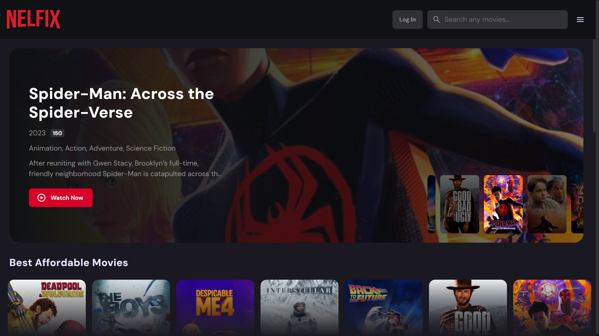
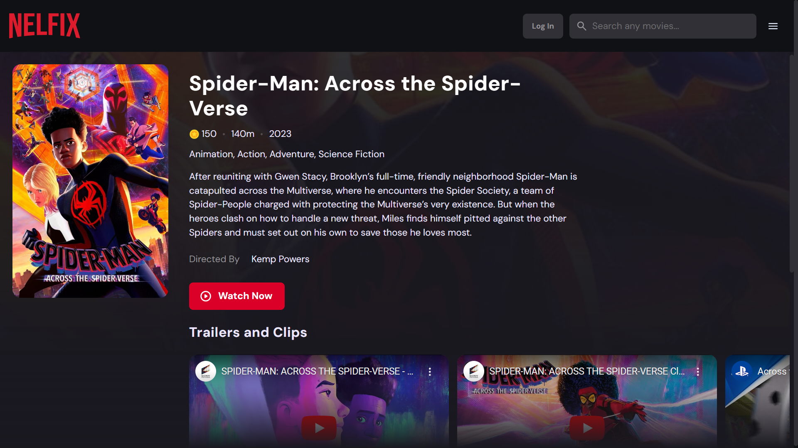
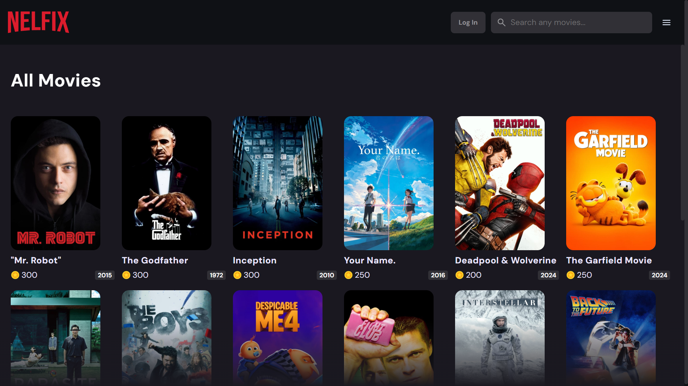
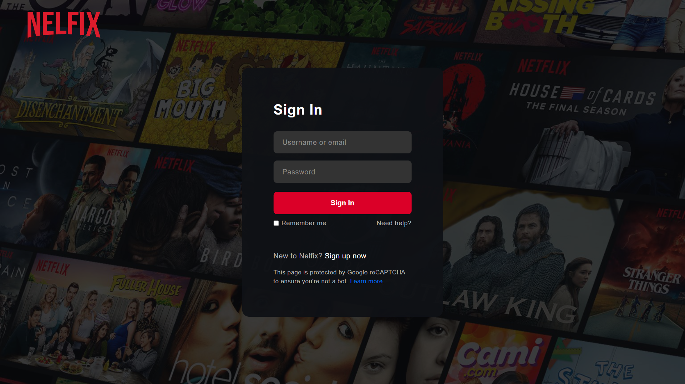

<h1 align="center">📺 Nelfix</h1>

<p align="center">
  <em>A full-stack movie streaming platform — browse, purchase, and watch films — built with NestJS, Prisma, PostgreSQL, and Amazon S3.</em>
</p>

<p align="center">
  
  
  
  
  
</p>

---

## 🔍 Table of Contents

- [Overview](#overview)
- [Key Features](#key-features)
- [Preview](#preview)
- [Tech Stack](#tech-stack)
- [Getting Started](#getting-started)
- [Design Patterns](#design-patterns)
- [API Reference](#api-reference)
- [Contributor](#contributor)

---

## 📖 Overview

**Nelfix** is a movie streaming web application where users can browse a film catalogue, view trailers and details, top up their balance, and purchase films to add to their personal library. Administrators get a full CRUD interface over the film catalogue and the user base.

The project is built as a monolithic **NestJS** application that serves both a server-rendered frontend and a documented REST API. Film posters and video files are stored in an **Amazon S3** bucket, while all relational data is persisted in **PostgreSQL** through **Prisma ORM**. The entire database layer runs in Docker for a reproducible local setup.

The codebase deliberately applies three classical design patterns — **Singleton**, **Command**, and **Facade** — to keep the data-access, query, and file-storage layers decoupled and reusable across both the web and API entry points.

---

## ✨ Key Features

| | |
|---|---|
| 🔐 **Authentication & authorisation** | Session-based login and signup with separate user and admin roles |
| 🎬 **Film catalogue** | Browse, search, and filter the full film library |
| 💳 **Balance & purchases** | Top up balance and buy films, which are then added to a personal library |
| 📼 **Trailer playback** | Watch film trailers directly in the browser |
| ☁️ **Cloud storage** | Posters and video files uploaded to and served from Amazon S3 |
| 🛠️ **Admin panel** | Full CRUD over films and users, including balance adjustments |
| 📱 **Responsive UI** | Layout adapts cleanly from mobile to desktop |

---

## 👀 Preview

| Home | Film Detail |
|:---:|:---:|
|  |  |

| All Films | Login |
|:---:|:---:|
|  |  |

---

## 💻 Tech Stack

| Layer | Technology | Version |
|---|---|---|
| Backend framework | NestJS | 10.4.4 |
| ORM | Prisma | 5.18.0 |
| Database | PostgreSQL | 13.5 |
| Containerisation | Docker | 25.0.3 |
| Package manager | NPM | 10.3.0 |
| Object storage | Amazon S3 | — |
| Frontend | Vanilla HTML, CSS, JavaScript | — |

---

## 🚶 Getting Started

### Prerequisites

- [Node.js](https://nodejs.org/) with NPM 10.3.0 or newer
- [Docker](https://www.docker.com/) and Docker Compose
- An AWS account with an S3 bucket

### Installation

**1. Clone the repository**

```bash
git clone https://github.com/qrst0/Nelfix.git
cd Nelfix
```

**2. Configure environment variables**

Create an S3 bucket, then create a `.env` file in the project root containing your bucket name, bucket region, and AWS access credentials.

```env
AWS_BUCKET_NAME=your-bucket-name
AWS_BUCKET_REGION=your-bucket-region
AWS_ACCESS_KEY=your-access-key
AWS_SECRET_ACCESS_KEY=your-secret-access-key
```

**3. Install dependencies**

```bash
npm install
```

**4. Start the database**

```bash
docker-compose up
```

**5. Run migrations and seed the database**

In a new terminal:

```bash
npx prisma migrate dev --name init
```

**6. Start the application**

```bash
npm run start:dev
```

**7. Open the app**

Navigate to [http://localhost:3000](http://localhost:3000) in your browser.

> 💡 The seeding process creates an admin account with the username `admin` and the password `admin123`.

### Shutting down

```bash
docker-compose down --volumes
```

---

## 📊 Design Patterns

### 1. Singleton

The Singleton pattern controls access to the database. Because the database is used throughout the entire application, a single globally accessible instance is required. Classes that interact with the database — such as `UsersService`, `FilmService`, and `HistoryService` — are instantiated as singletons. They expose database operations as services to the rest of the application, so no other part of the codebase talks to the database directly.

### 2. Command

The Command pattern is used to execute operations such as querying films and fetching film details. The routes serving the frontend are separate from those serving the REST API, yet both rely on the same film-query logic. Encapsulating that logic in a command class means the query operation is written once and executed from either entry point.

### 3. Facade

The Facade pattern is applied primarily to file and video uploads. It hides the implementation details of uploading to and deleting from the Amazon S3 bucket — key extraction, the upload/delete calls, and URL generation are all tucked behind a service class. Callers get simple upload and delete functionality without any of the underlying complexity.

---

## 📞 API Reference

### Web Pages (server-rendered frontend)

| Method | Endpoint |
|---|---|
| `GET` | `/` |
| `GET` | `/login` |
| `GET` | `/signup` |
| `GET` | `/index` |
| `GET` | `/detail` |
| `GET` | `/movie-list` |
| `GET` | `/all-films` |
| `GET` | `/bought-films` |

### REST API

| Method | Endpoint | Description |
|---|---|---|
| `POST` | `/login` | Authenticate a user |
| `GET` | `/users` | List all users |
| `GET` | `/users/{id}` | Retrieve a single user |
| `DELETE` | `/users/{id}` | Delete a user |
| `POST` | `/users/{id}/balance` | Adjust a user's balance |
| `POST` | `/films` | Create a film |
| `GET` | `/films` | List all films |
| `GET` | `/films/{id}` | Retrieve a single film |
| `PUT` | `/films/{id}` | Update a film |
| `DELETE` | `/films/{id}` | Delete a film |
| `GET` | `/self` | Retrieve the authenticated user |

### Frontend Communication Endpoints

| Method | Endpoint | Description |
|---|---|---|
| `POST` | `/fecomm/login` | Log in from the web client |
| `POST` | `/fecomm/signup` | Register from the web client |
| `GET` | `/fecomm/films/{id}` | Fetch film details |
| `POST` | `/fecomm/films/{id}` | Purchase a film |
| `GET` | `/fecomm/allfilms` | Fetch the complete film catalogue |
| `GET` | `/fecomm/films` | Fetch a filtered list of films |
| `GET` | `/fecomm/users/{id}` | Fetch a user's data |
| `GET` | `/fecomm/authme` | Verify the current session |
| `GET` | `/fecomm/user` | Fetch the authenticated user's profile |
| `GET` | `/fecomm/get-bought` | Fetch the authenticated user's purchased films |

---

## 🙇‍♂️ Contributor

| Name | Student ID | Email | GitHub |
|---|---|---|---|
| Kristo Anugrah | 13522024 | [13522024@std.stei.itb.ac.id](mailto:13522024@std.stei.itb.ac.id) | [@qrst0](https://github.com/qrst0) |
